# 学生成绩管理系统
## 目录  
- ### [构建与运行](#构建与运行)
    - #### [注意事项](#注意事项)
    - #### [Linux环境下的构建（推荐）](#Linux环境下的构建（推荐）)
    - #### [Windows环境下的构建](#Windows环境下的构建)
- ### [功能演示](#功能演示)
- ### [代码说明](#代码说明)  

--- 
---
---  
## 构建与运行<a name="构建与运行"></a>
### 注意事项<a name="注意事项"></a>
- 请注意，本项目根目录下有两个txt文件：`grades.txt`和`input.txt` 。
    - `grades.txt`是学生管理系统的存储文件，每次运行学生管理系统时，都会自动读取`grades.txt` 。每次修改、添加学生时，也会自动修改。请 **尽量不要手动修改** ！
    - `input.txt`是用于 “学生成绩输入功能->文件输入方式” 的指定输入文件。在输入时，请按照**指定格式编写输入信息 :**
        - 请在第一行输入表头，先输入“姓名”，再输入各个科目，比如“***姓名 数学 英语 语文***”（不要输入引号）等。“姓名”前不要加空格，姓名、各个科目之间加入一个空格。科目的输入顺序不重要，可以任意替换，科目的数量可以增加或减少。
        - 下来输入学生成绩，先输入学生姓名，再输入各个科目对应成绩。姓名前不要加空格，姓名、各个科目成绩之间加入一个空格。比如“***张三 98 缺省 81***”（不要输入引号）等。
        - `input.txt`中输入学生成绩信息，如果系统中原本没有这个学生的信息，那么系统将添加这个学生，如果原本有这个学生，那么将修改此学生成绩。
        - 本系统管理的科目的数量、类别由`input.txt`决定，如果`input.txt`中输入的科目增加或减少，那么系统中的科目也将随之增加或减少。如果减少一个科目，那么原本系统中记录的学生的该项科目成绩也将随之隐藏，如果增加一个科目，那么原本系统中记录的学生的该项科目成绩将变为 “缺省” 。  
  

- 对于Linux环境下，没有什么要注意的，因此推荐使用linux。  

- 对于Windows环境下，请注意：
    - 要确保安装了MinGW——Minimalist GNU For Windows。本项目在Windows下使用mingw32-make，不使用MSVC。
    - 请不要自行创建build文件夹，然后自行执行cmake、make，也不要自行运行编译好的可执行文件、测试文件等。因为本项目使用UTF-8编码，中文输出在Windows默认的控制台会输出乱码。除非你事先设置`chcp 65001`。推荐的构建方式请看    - [Windows环境下的构建](#Windows环境下的构建)。
    - 在Windows环境下，由于设置了UTF-8编码，所以在输入/修改学生成绩时，查找的学生姓名如果为中文的话，请保证输入为UTF-8格式的编码，否则系统将识别为乱码。若姓名为英文，则无此顾虑。
    - 以上操作在Linux环境中均无需考虑，因此推荐使用Linux  


### Linux环境下的构建（推荐）<a name="Linux环境下的构建（推荐）"></a>
- 要构建和运行学生成绩管理系统，请在命令行中切换至本项目的根目录，然后执行
    ```bash
    sh run.sh
    ```
    系统会自动创建`bin`目录和`build`目录，并启动学生管理系统。<br/>`build`目录是存放构建过程文件的目录，`bin`目录则存放可执行文件、动态链接库等，其目录结构如下
    ```
    bin
    ├── GradeManagementSystem  //这是学生管理系统的可执行文件
    ├── plugins         //这是存放扩展功能的动态链接库的文件夹
    │   ├── libdefaultdata.so      //这是-查找分数缺省的数据-的动态库
    │   └── libtimer.so       //这是定时器的动态库
    └── test               //这是测试程序的可执行文件的文件夹
        ├── DefaultDataPluginTests  //测试 查找分数缺省的数据功能
        ├── GradeManagerTests    //测试学生管理系统的功能
        ├── StudentTests       //测试学生类的功能
        └── TimerPluginTests     //测试定时器
    ```
    在运行`run.sh`之后，就可以构建并运行学生管理系统，如果想要运行测试程序，可以一个个运行`bin/test`下的文件，也可以在工程根目录下执行<br/>
    ```bash
    sh test.sh
    ```
    测试框架使用的是gtest、gmock，测试用例存放在`test`文件夹下，可自行添加  


### Windows环境下的构建<a name="Windows环境下的构建"></a>
- Windows环境下的构建过程与在Linux中类似，不过首先请**确保安装了MinGW**<br/>
双击，或在命令行中执行`run.bat`。系统会自动创建`bin`目录和`build`目录，并启动学生管理系统。其结构与在Linux中生成的一致。
- 请**不要自行运行生成的可执行文件**，请通过`run.bat`和`test.bat`来启动程序和测试程序。
- 如果构建过程出错（可能是由于环境配置问题，或者文件错误），请运行`run_copy.bat`和`test_copy.bat`。这是Windows环境下的备份文件，备份的可执行文件放在`bin_copy`目录下，这是已经编译好的。   

## 功能演示<a name="功能演示"></a>
#### [1. 录入成绩](#录入成绩)  
    录入新同学成绩，成绩可能来自于命令行输入的字符串或指定的成绩单文件  
#### [2. 查询成绩](#查询成绩)  
    a. 查询科目最高/最低分  
    b. 以各科成绩对同学姓名排序  
    c. 各科目平均分  
#### [3. 修改成绩](#修改成绩)  
#### [4. 扩展功能](#扩展功能)  
    a. 查找分数缺省的数据  
    b. 基于C++标准库实现定时器，可定期执行指定的一项基础功能  
#### [5. 测试](#测试)  
    a. 测试Student类的功能  
    b. 测试成绩管理系统类的功能  
    c. 测试插件-寻找缺省信息的功能  
    d. 测试插件-定时器的功能  


### 录入成绩<a name="录入成绩"></a>
- 文件录入  
    1. 录入之前，如图1<br/><div align=center >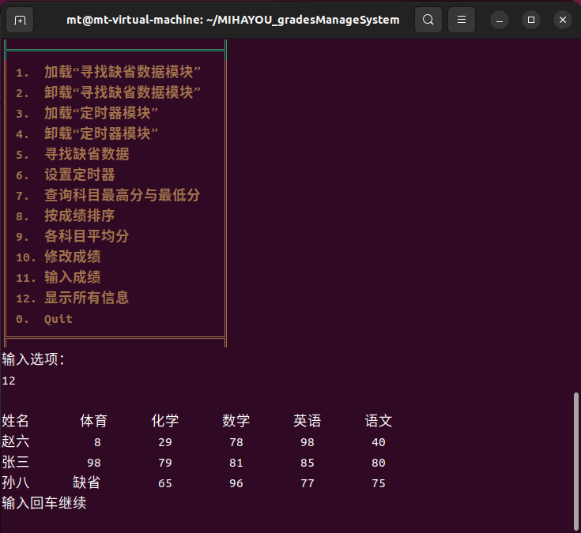<br/>图1</div><br/>
    2. 录入之后，如图2<br/><div align=center >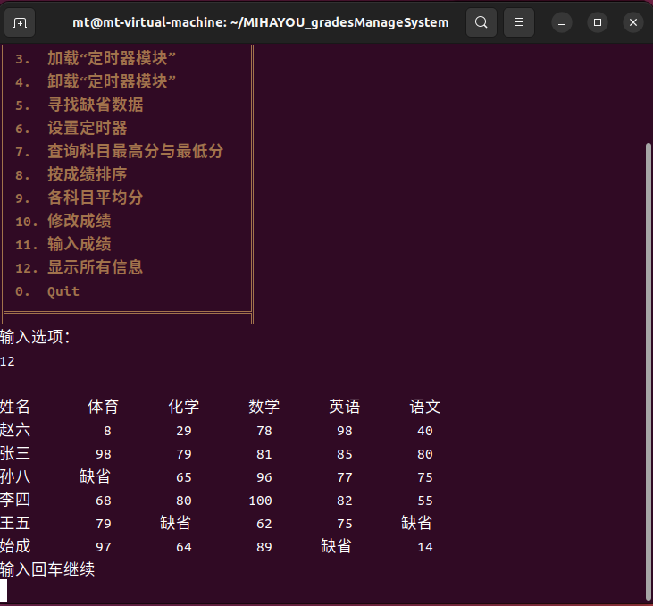<br/>图2</div><br/>
- 手动录入
    1. 录入中，如图3<br/><div align=center >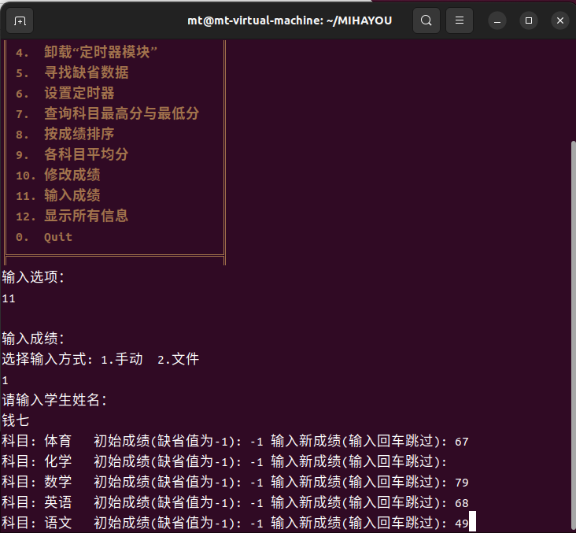<br/>图3</div><br/>
    2. 录入之后，如图4<br/><div align=center >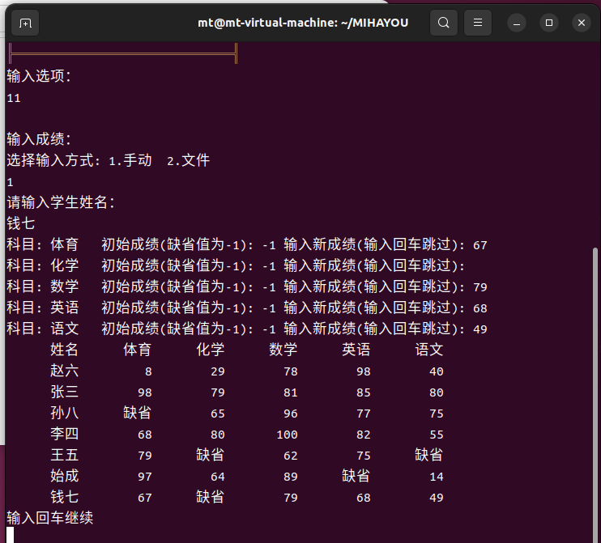<br/>图4</div><br/>


### 查询成绩<a name="查询成绩"></a>
- 查询科目最高/最低分  
    如图5<br/><div align=center >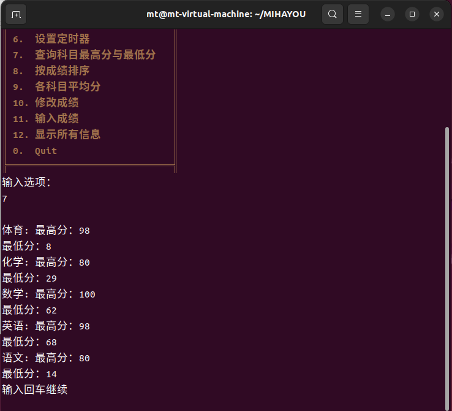<br/>图5</div><br/>
- 以各科成绩对同学姓名排序  
    如图6<br/><div align=center >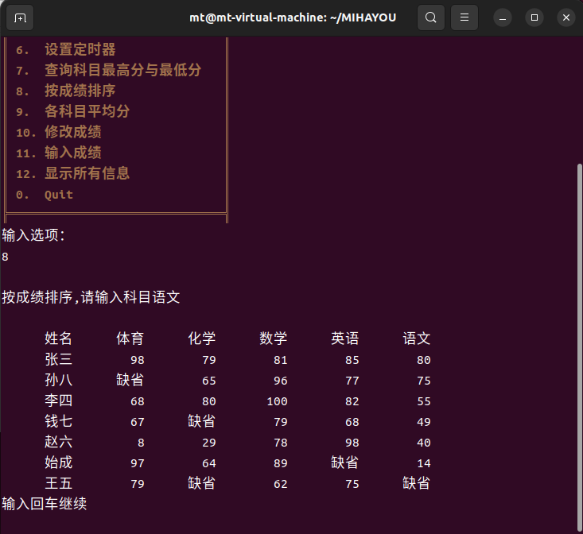<br/>图6</div><br/>
- 各科目平均分  
    如图7<br/><div align=center >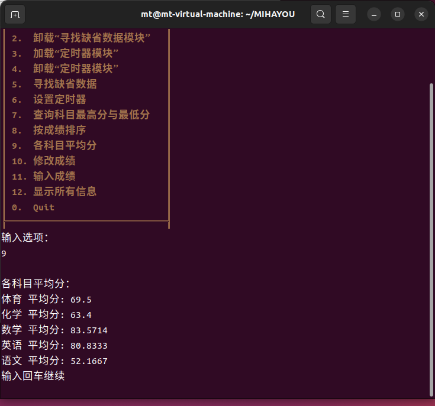<br/>图7</div><br/>  

### 修改成绩<a name="修改成绩"></a>
- 如图8<br/><div align=center >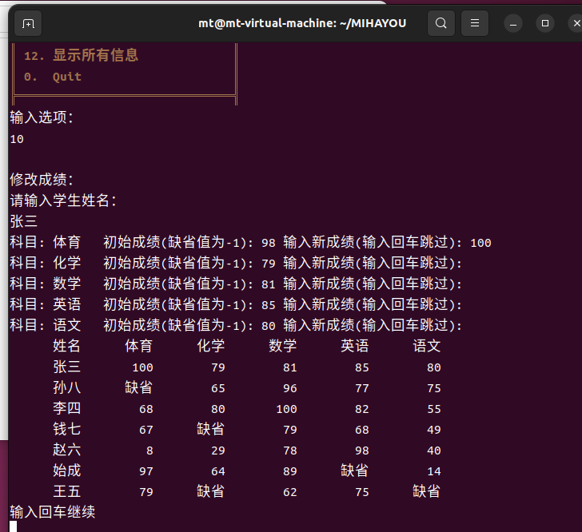<br/>图8</div><br/>  

### 扩展功能<a name="扩展功能"></a>
- 1.查找分数缺省的数据  
    首先加载“寻找缺省数据模块” ，然后寻找缺省数据如图9<br/><div align=center >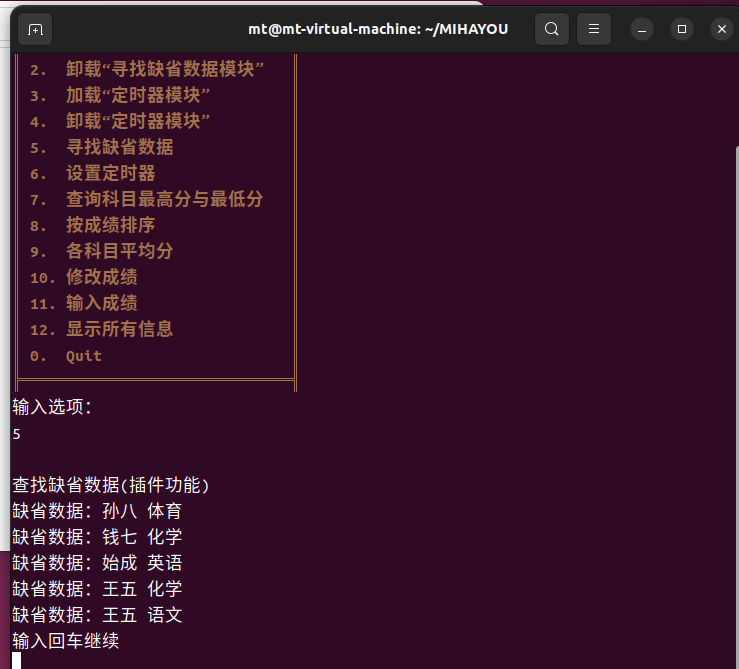<br/>图9</div><br/> 

- 2.定时器
    如图10，11有gif演示（markdown可能加载不出来，请在picture文件下寻找）<br/><div align=center ><br/>图10</div><br/><br/><div align=center ><br/>图11</div><br/><br/>  


### 测试<a name="测试"></a>
- 如图12、13<br/><div align=center >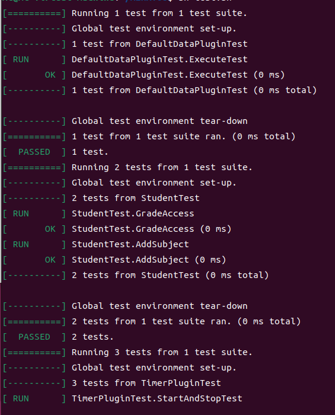<br/>图12</div><br/><br/><div align=center >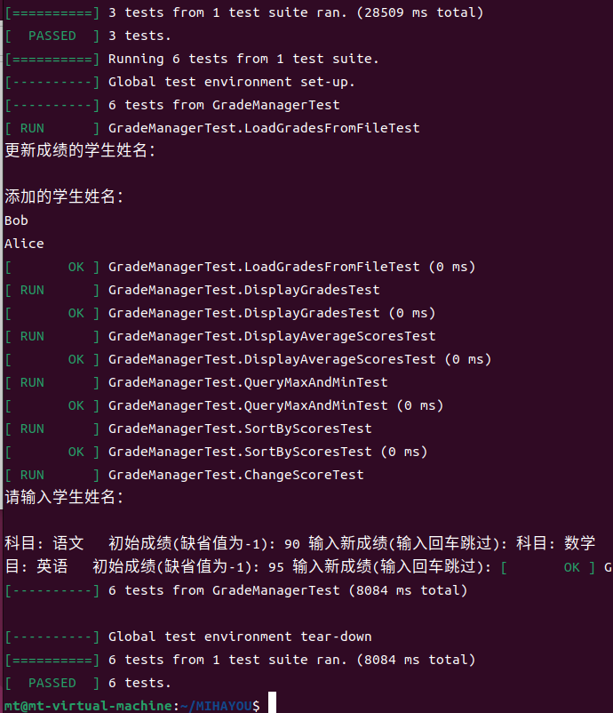<br/>图13</div><br/>    


## 代码说明
项目目录如下
```c
gradesManageSystem/
├── build
├── CMakeLists.txt
├── grades.txt
├── input.txt
├── run.bat
├── run.sh
├── test.bat
├── test.sh
├── src
│   ├── GradeManager
│   │   ├── CMakeLists.txt
│   │   ├── GradeManager.cpp
│   │   └── GradeManager.h
│   ├── main_Linux.cpp
│   ├── main_Windows.cpp
│   ├── plugins
│   │   ├── CMakeLists.txt
│   │   ├── DefaultDataPlugin
│   │   │   ├── DefaultDataPlugin.cpp
│   │   │   └── DefaultDataPlugin.h
│   │   ├── PluginInterface.h
│   │   └── TimerPlugin
│   │       ├── TimerPlugin.cpp
│   │       └── TimerPlugin.h
│   └── Student
│       ├── CMakeLists.txt
│       ├── Student.cpp
│       └── Student.h
└── test
    ├── CMakeLists.txt
    ├── GradeManager
    │   └── GradeManagerTest.cpp
    ├── plugins
    │   ├── DefaultDataPlugin
    │   │   └── DefaultDataPluginTest.cpp
    │   └── TimerPlugin
    │       └── TimerPluginTest.cpp
    ├── Student
    │   └── StudentTest.cpp
    └── google_test
```
这个项目是一个学生成绩管理系统，用于管理学生的成绩信息。下面我将详细介绍各个类型、功能和接口，并展示项目中使用的模块化、层次化和封装继承的思想。  

类型与接口声明：  
a) Student 类:  

用于表示学生对象，包含学生的姓名和成绩信息。
```c++  
成员函数：  
构造函数 Student(const std::string& name): 创建一个具有给定姓名的学生对象。  
std::string getName() const: 获取学生姓名。  
void setScore(const std::string& subject, int score): 设置学生在指定科目的成绩。  
int getScore(const std::string& subject) const: 获取学生在指定科目的成绩。  
std::map<std::string, int>& getScores(): 获取学生的成绩信息。  
```
b) GradeManager 类:

用于管理学生和成绩信息的主要类。  
```c++
成员函数：
void inputGradesFromConsole(): 从控制台输入学生成绩信息。
void loadGradesFromFile(const std::string& filename): 从文件加载学生成绩信息。
void displayGrades(): 显示学生成绩信息。
void displayAverageScores(): 显示平均成绩。
void modifyScore(): 修改学生成绩。
void queryMaxAndMin(): 查询最高分和最低分。
void sortByScores(): 按成绩排序。
std::vector<Student>& getStudents(): 获取学生对象的列表。  
```
c) PluginInterface 类:  
插件接口，定义了插件的执行函数。
```c++
成员函数：
virtual void execute(GradeManager*) = 0: 执行插件操作的纯虚函数。
```
d) TimerPlugin 类:  

继承自 PluginInterface，实现了定时执行操作的插件。  
```c++
成员函数：
TimerPlugin(int intervalInSeconds, std::function<void()> callback): 构造函数，设置定时器的间隔和回调函数。
void start(): 启动定时器。
void stop(): 停止定时器。
void execute(GradeManager*) override: 执行插件操作的函数。
```
e) DefaultDataPlugin 类:   

继承自 PluginInterface，实现了添加默认数据的插件。  
```c++
成员函数：
void getDfaultData(GradeManager*) const: 添加默认数据。
void execute(GradeManager*) override: 执行插件操作的函数。
```
功能和接口说明：
a) GradeManager 类功能：
```c++
inputGradesFromConsole(): 从控制台输入学生成绩信息。
loadGradesFromFile(const std::string& filename): 从文件加载学生成绩信息。
displayGrades(): 显示学生成绩信息。
displayAverageScores(): 显示平均成绩。
modifyScore(): 修改学生成绩。
queryMaxAndMin(): 查询最高分和最低分。
sortByScores(): 按成绩排序。
getStudents(): 获取学生对象的列表。
```
b) PluginInterface 接口：
```c++
execute(GradeManager*): 插件执行函数，用于在 GradeManager 中执行插件的操作。
```
c) TimerPlugin 类功能：
```c++
start(): 启动定时器，定时执行回调函数。
stop(): 停止定时器。
execute(GradeManager*): 执行插件操作的函数。
```
d) DefaultDataPlugin 类功能：
```c++
getDfaultData(GradeManager*): 添加默认数据。
execute(GradeManager*): 执行插件操作的函数。
```
- 模块化、层次化和封装继承思想的体现：
该项目展示了模块化的设计，通过将不同功能和类型封装为独立的类，实现了高内聚、低耦合的模块结构。每个类都有明确定义的职责，使得代码易于理解、维护和扩展。

- 层次化的思想体现在 GradeManager 类的设计中。GradeManager 类作为核心类，负责管理学生和成绩信息，并提供了一系列操作函数供外部调用。它通过与 Student 类和插件接口 PluginInterface 进行交互，实现了对学生和插件的管理。

- 封装继承思想体现在 PluginInterface、TimerPlugin 和 DefaultDataPlugin 类中。PluginInterface 定义了插件的接口规范，使得插件可以独立于具体的实现。TimerPlugin 和 DefaultDataPlugin 类继承自 PluginInterface，并实现了自己的插件功能，通过重写 execute 函数来执行特定的操作。这种设计使得插件可以灵活扩展，同时保持了接口的一致性。

#### 使用的技术：
该项目使用了以下技术：

- C++语言：项目使用C++语言进行开发，利用面向对象编程的思想来设计和实现各个类。
- 标准库：项目使用了C++标准库中的string、map、vector等容器和算法，以及iostream和fstream等输入输出操作。
- 文件操作：通过读取和写入文件，实现了学生成绩的持久化存储和加载。
- 多线程：TimerPlugin 类中使用了std::thread实现了定时器功能，通过在单独的线程中执行回调函数。
- 智能指针：使用了std::unique_ptr来管理插件对象的内存，确保资源的正确释放和管理。
##### 总结：该项目通过模块化、层次化和封装继承的设计思想，实现了学生成绩管理系统的各项功能，并利用多线程和智能指针等技术实现了定时插件和插件扩展的功能。这种设计使得代码结构清晰、易于维护和扩展。